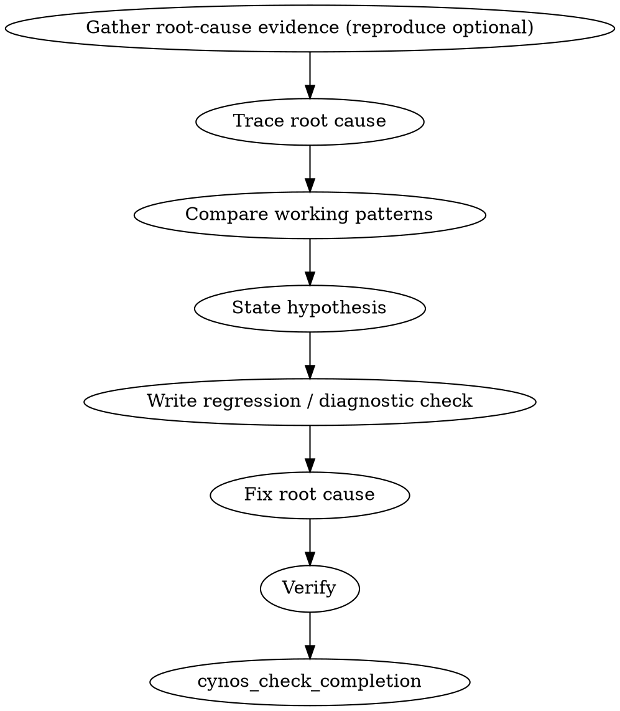

# Debug Practice

Iron rule: **no fixes before root cause evidence.**

Root cause evidence can come from reproduction, **but also from logs, stack traces, or source tracing** — reproduction is ONE path to the root cause, not a requirement. A mature logging system or a clear stack trace can pinpoint the cause directly without reproducing. Not every bug can be reproduced (intermittent / race / environment / external-state), and that is not a failure.

Guessing creates churn. Symptom patches do not count as debugging.

Boundary: choose `debug` when a page or system is broken (errors, failed tests, click does nothing, data is wrong, a valid input cannot save). If the page works but is awkward to use (input too narrow, button too small, overflow, focus/keyboard friction), use `usability` instead. If the user asks for a new capability or changed business/product behavior, use `develop`.

## Systematic method

Use four phases. Do not skip ahead just because the fix looks obvious.

### Phase 1: Root cause investigation

- Read errors, warnings, logs, and stack traces completely.
- Gather root-cause evidence. Reproduction is ONE path — read errors/logs/stacks first; if they pinpoint the cause, reproduction is optional. When you DO reproduce, do it at the layer/surface where the bug was REPORTED (a web-reported symptom at the web layer; an API-reported symptom at the API layer) — even if you already suspect a deeper root cause.
- Check recent changes, dependency/config/environment differences, and comparable paths.
- In multi-component systems, gather evidence at each boundary before proposing fixes: what enters, what exits, and where state/config changes.
- Trace the bad value/state backward to where it first becomes wrong. Fix at the source, not where the symptom appears.

### Phase 2: Pattern analysis

- Find similar working code in the same project and compare it against the broken path.
- Read reference implementations or surrounding patterns fully enough to understand them; do not adapt from a skim.
- List the meaningful differences before choosing a fix.

### Phase 3: Hypothesis and testing

- State one specific hypothesis: “I think X is the root cause because Y.”
- Test one variable at a time with the smallest useful diagnostic or change.
- If the hypothesis fails, return to investigation with the new evidence. Do not stack unrelated patches.

### Phase 4: Implementation

- Create the smallest regression or diagnostic check that proves the bug when possible.
- Implement one fix that addresses the evidenced root cause.
- Verify the fix and the relevant surrounding behavior.
- If three fix attempts fail, stop. Question the architecture, assumptions, or problem framing before attempting a fourth patch; ask the user only if that decision blocks safe progress.

## Flow

## Required behavior

1. **Start the auditable work early.** Once routing is clearly `debug`, call `cynos_start_work(practice="debug")` before any diagnostic action beyond read-only context reads. Pre-start context reads are carried over into the work record, so reads done for routing also count — but start the work before audited actions (reproduction runs, edits, verification), which are not captured pre-start. A reported bug, failure, error, crash, or unexpected behavior — even without a file path, even when the user says "don't change code" (the fix may be config/env, recorded via `fix.noFileChangeReason`), or "I can't reproduce it" (use the `reproduction.kind='unreproducible'` escape) — is debug work. Recognizing "this is a debug task" is not enough; you must actually call `cynos_start_work`. Do not answer a bug report with prose analysis or ad-hoc bash fixes while skipping the work record.
2. **Consult project memory when it matters.** `PROJECT.md` and `docs/testing.md` encode architecture boundaries, the verification matrix, diagnostic/log map, browser/surface-verification rules, and where bugs usually live. Read them early when the bug depends on project boundaries, diagnostics, verification strategy, or unknown architecture. This is a skill expectation, not a completion hard gate; do not fabricate doc reads for unrelated tiny fixes. `docs/release.md` is not required by default; read it only when the current bug directly involves release/deploy/publish/tag/rollback, CI/CD release artifacts, commit hooks, or release packaging.
3. Evidence the root cause. Reproduction is optional — root cause can be established through logs, stack traces, or source tracing. When you DO reproduce, do it at the layer where the bug was reported (web symptom → reproduce the web behavior; API symptom → reproduce the API response); do not only reproduce a deeper-layer signal and call it done. Final verification must re-run that same reported scenario, not only a deeper-layer check. If you need user-only facts (environment, account, expected business behavior) and continuing would risk debugging the wrong thing, use `cynos_ask_user`; otherwise keep exploring.
4. Use the diagnostic/log map in `docs/testing.md` when present. Read the relevant error output, logs, stack traces, browser console/network evidence, CI logs, and read-only DB evidence when applicable. If the map is missing or wrong and you discover a stable diagnostic source future agents need, update `docs/testing.md` before completion.
5. Read error messages and stack traces fully. If a failed command/test prints a stack or key error, summarize it in `diagnostics`.
6. Check recent changes and comparable working code.
7. Trace the bad value/state to its source and record the targeted investigation: related files read and flow/boundary traced.
8. State one root cause with evidence before fixing.
9. Regression red/green is OPTIONAL when you did not reproduce (there is no red to turn green — the root cause was evidenced via logs/stack/tracing). When you DID reproduce, prefer red/green — reproduce the reported symptom (red), fix, then verify the same scenario passes (green); prefer leaving behind a regression test that proves the bug. If the bug is browser/user-flow/integration-level, use `verification-method` inside this debug work:
   - failing test/browser evidence before the fix when possible
   - passing test/browser evidence after the fix
   - You do **not** need to know or invent runtime `toolCallId`s. The completion check can infer red/green from captured tool results. Do not inspect session logs just to find IDs.
   - config/env/external-service bugs with no code change use `fix.noFileChangeReason`; when red/green cannot be automated, use `regression.unavailableReason` + `regression.alternativeVerification`.
   - **Prefer running the failing command directly as red/green evidence.** The checkpoint can recover echo-masked **failed/red** evidence from recognized test/verification commands (`; echo "exit:$?"`) — it sees through the masking and recognizes a genuine failure from the test output. There is no equivalent see-through for masked **green/success**, so err on the side of clean final-verification commands. In practice masked greens work naturally (`cmd; echo "exit:$?"` is `isError=false` when the underlying test passed), but prefer direct commands for clarity. If you need the exit code for your own debugging, inspect `$?` in a separate step or use `set -o pipefail`.
10. Run final verification before claiming completion. **Consult the verification matrix in `docs/testing.md`** — a bug fix in a cross-stack layer may need more than a single test command. For browser/runtime bugs, use the `browser-automation` skill (`npx --yes @playwright/cli`) to reproduce with snapshot/screenshot/console/requests/eval evidence. `debugging.reproduction.kind='browser'` requires captured Playwright CLI direct browser evidence; `debugging.diagnostics.browserEvidence` / `networkEvidence` only summarize what that captured evidence showed. Project e2e/test runners may be extra verification, but they do not replace direct browser evidence for UI/browser gates. If browser startup fails because of missing system dependencies, follow the browser-automation blocked-environment policy rather than repeatedly downloading browsers or using unapproved hacks. If browser verification is blocked, record strict fallback fields in `surfaceVerification`: `blockedReason`, `attemptedApproaches[]` (>=2), `alternativeVerification`, and `degradedEvidence`; the checkpoint also requires real failed browser attempts. Run the commands the matrix requires for the change scope. The completion check proves you ran a real successful command; your responsibility is to choose the correct command by reading the project's testing document.
11. After successful verification, follow the Cynos local commit policy: commit this fix locally unless the user explicitly opted out. Never push/tag/publish/deploy in debug. If `git commit` fails, record `commit.status='failed'` with the real reason; do not bypass hooks or retry blindly. If the user asked to publish/release, finish this work and wait for explicit `release` work.
12. Before completion, apply `skills/cynos/references/project-memory-maintenance.md`: update durable project memory only if the bug revealed a long-lived project fact, risk, invariant, or testing/release rule future agents need. Record the decision in `projectImpact` either way.
13. Provide a structured debug report in completion evidence and final response: symptom, reproduction, diagnostics, root cause, fix, verification, evidence artifacts, project memory/docs decision, and commit status.

## Subagent use

Use subagents as a recommended option, never a hard requirement. Debug's built-in red/green already proves the fix for the reported case, so subagents focus on the gaps red/green cannot cover: root-cause confidence and blast radius. Subagents are advisory and do not replace the main work's reproduction, project-doc reads, verification, or completion evidence.

When to use which (trigger only when the condition holds; most bugs need none):

- `explorer`: independent local trace across modules/layers when the bug spans multiple files, boundaries, or unclear ownership.
- `challenger`: challenge a root-cause hypothesis when the evidence is **circumstantial** (inferred by reasoning, not directly pointed at by a stack/log/reproduction), OR after the first fix attempt failed verification (hypothesis falsified), OR the fix touches auth / concurrency / data contracts / external services / migrations. A stack trace that directly names the root cause does **not** need a challenger.
- `reviewer`: review the final fix when it touches multiple modules, user-visible flows, data/integration contracts, or durable docs. The reviewer's job is blast radius and regression-coverage blind spots — not re-proving the fix itself (red/green already did that).
- `researcher`: investigate external framework/runtime/browser/dependency behavior; researcher does not receive PROJECT.md context, so provide only non-sensitive external facts.
- `looker`: inspect screenshots or visual evidence when vision is useful and a vision model is configured.

When asking a subagent about verification, logs, browser/surface-verification, release readiness, or diagnostics, explicitly tell it to read `docs/testing.md` (and `docs/release.md` only if release-related). Non-researcher subagents receive `PROJECT.md` context automatically, but not `docs/testing.md` / `docs/release.md`; subagent context does not replace the main work's responsibility to consult project docs when they affect correctness.

## Database diagnostics

If the root cause involves database state, check `docs/testing.md` for the project's database safety rules — which targets are safe to query, which require explicit authorization, and any read/write restrictions. If `docs/testing.md` doesn't cover databases or you're unsure whether a target is safe, ask the user before running the command. Record the sanitized DB query excerpt in `diagnostics.evidenceRead[]` like any other error/log/stack evidence — DB is no longer a separate `databaseEvidence` declaration. Never paste secrets, tokens, or unnecessary PII.

## One bug per work

`debug` models a **single bug per work**. Each bug needs its own focused reproduction, root cause, fix, and verification; merging unrelated bugs into one work breaks evidence isolation and the single-root-cause discipline. If the list is large, heterogeneous, or mostly triage/project-management, use a dedicated stabilization/bug-bash flow, not debug.

### Multi-bug input: split at the entry, then run sequentially

When the user's request contains **more than one independent bug** (for example: "these two tests both fail: `tests/a.test.js` and `tests/b.test.js`", or a bug list with several distinct symptoms), do **not** bundle them into one debug work. Instead:

1. **At the entry**, before starting any work, read the request and decide how many independent bugs it contains. This is the only place aggregation happens — in your head, not in the evidence. **Immediately write the full bug list (each item: file/symptom, one line) into the first work's `objective`** as `bug 1/N: ...; bug 2/N: ...; ...`. This survives compaction; conversation memory does not. Do not rely on remembering the list from chat history.
2. **Process the bugs strictly sequentially, one at a time:** start a `debug` work for the first bug, reproduce → diagnose → fix → verify → `cynos_check_completion`. Only after that work is completed and archived do you start the next `debug` work for the next bug. Each subsequent work's `objective` repeats the remaining items (`bug 2/3: ...; remaining: bug 3/3: ...`).
3. **Never run multiple debug works in parallel.** There is only one active work per project at a time; parallel works corrupt state. Sequential is the only correct execution.
4. **If the context was compacted between works** (the prior work's chatter is gone), reconstruct the remaining todo from `.cynos/last-outcome.json` and the prior work's `objective`/archive under `.cynos/archive/` — do NOT assume the bug list is exhausted just because chat history no longer mentions the other bugs. The archive is the source of truth, not compressed memory.
5. **Do not merge into a single `debugging.fix.filesChanged[]`.** Two failing tests in one suite are two bugs if they have distinct root causes — each gets its own work with its own single root cause. The completion check correctly accepts a multi-file fix only when those files all serve *one* root cause.
6. Report each bug's outcome as you complete it. Do not hold all results and emit one combined summary at the end — the user gets a per-bug debug report per work.

Why this matters: the single-bug model is what makes the evidence trustworthy. Bundling N bugs into one work means one red + one green bash can satisfy N root causes at once, voiding the gate. Splitting at the entry and running sequentially preserves isolation. Writing the list into each `objective` (not relying on chat memory) is what prevents compaction from silently dropping unprocessed bugs.

## Completion evidence

The exact `completionEvidence` schema returned by `cynos_start_work` / failed `cynos_check_completion` is authoritative. Required intent (single `debugging` block per work):

- `criteriaCoverage` covers every acceptance criterion
- `debugging.reproduction` records the reported-layer reproduction, or an unreproducible reason
- `debugging.diagnostics` records diagnostic summaries: `evidenceRead[]` (key error / log / stack / db-query excerpts, sanitized) and/or `browserEvidence` / `networkEvidence` (or a blocked reason for browser bugs). For `reproduction.kind='browser'`, these text fields are not evidence by themselves; capture Playwright CLI direct browser evidence or strict blocked fallback. DB is just another evidence source — no separate used/notUsedReason declaration
- `debugging.investigation.relatedFilesRead[]` lists source/test files you read; **each path must have a real `read` tool result** (pre-start context reads are carried over, so routing reads count). `flowsTraced[]` is optional/skill-guided — the tracing chain can also live in `rootCause.evidence[]`
- `debugging.rootCause.summary` plus `rootCause.evidence[]`
- `debugging.fix.summary` plus `filesChanged[]` or `noFileChangeReason`
- `debugging.regression` records red/green regression evidence, or `unavailableReason` + `alternativeVerification`
- `projectImpact` is skill-guided when no durable memory/docs changed; if you declare `durableMemoryUpdateNeeded=true` or list `updatedFiles`, those files must have real write/edit evidence
- `report` is skill-guided for the final user reply: symptom, reproduction, diagnostics, root cause, fix, verification, evidence artifacts, project memory/docs decision, and commit status. It is not a hard completion gate
- `surfaceVerification.summary` records direct browser evidence when applicable; if blocked, record `blockedReason`, `attemptedApproaches[]` (>=2), `alternativeVerification`, and `degradedEvidence`
- `verification.summary` describes the final real successful verification command
- `finalization` records verification, git status, and local commit status for this fix

Optional `toolCallId` fields are only for explicit references; leave them out rather than guessing. The completion check can infer failed/successful bash evidence from captured tool results.
