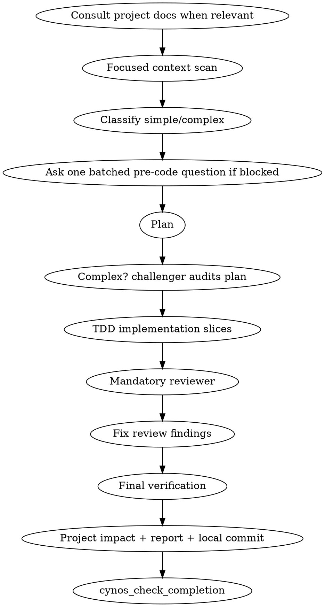

# Develop Practice

Develop is the **feature implementation expert** practice. Use it when the user asks to add or change behavior, implement a feature, change runtime/build/config behavior, or perform general development whose success depends on understanding existing code, designing an implementation path, coding, testing, reviewing, and reporting. Tests written to prove an implementation or regression fix stay in develop; testing-as-purpose belongs to `test`. If a frontend page already works but is awkward to use, route to `usability` for page-level UX improvement; if the page is broken, route to `debug`. Adding a new visible page control, user-triggered action, command, capability, flow, or rule is `develop` even when the motivation is usability (for example: Clear email button, Save draft action, new filter, new shortcut command, or new validation rule).

Do not choose `default` merely because this flow is heavier. If the task is feature implementation, user-visible behavior, business logic, data flow, API/command/page/state change, or real runtime configuration/CI/build configuration change, use `develop`. Tests written as part of implementation stay in develop; if writing/running tests and reporting a verdict is the user's primary purpose, use `test`. Use `default` only when no specific practice fits; user pressure for a weaker flow is not a reason to route develop-owned work to default.

## Flow

## Required behavior

1. **Start the auditable work early.** Once routing is clearly `develop`, call `cynos_start_work` before the focused context scan. Pre-start context reads are carried over into the work record, so files you read for routing also count — but start the work before audited actions beyond context reads (TDD test runs, subagents, edits, verification), which are not captured pre-start.
2. **Consult project memory when it matters.** Before designing, read `PROJECT.md` and `docs/testing.md` when the work depends on project boundaries, conventions, verification strategy, surface-verification/browser rules, diagnostics, or unknown architecture. They are important project knowledge, but this is a skill expectation rather than a completion hard gate; do not fabricate reads for tiny unambiguous local changes. Read `docs/release.md` only when the work directly involves release/deploy/publish/tag/rollback, release artifacts, or packaging.
3. **Do a focused context scan before planning.** Read the target files and related modules, not just grep hits. Find existing patterns, similar implementations, tests, and calling/data-flow edges. Record why the implementation will reuse or extend existing boundaries instead of duplicating them.
4. **Classify the task as simple or complex — the default is complex.** Before classifying, LIST the files you expect to change (source + docs + config all count). Only downgrade to simple after ticking ALL of these against that list: the requirement is clear; change is local; total changed files ≤5; no public API/data model/config/dependency/storage change; no global runtime behavior change; no cross-cutting concern (touching logger/feature-flags/config/middleware/auth/context/bootstrap files is complex by definition); no cross UI/backend/package/IPC/DB/external-service boundary; no auth/security/payment/concurrency/cache/async/migration risk; similar local pattern exists; verification is clear and local; durable PROJECT/docs changes are unlikely. If any condition fails, you are unsure, OR you have not yet listed the expected changed files, stay complex. The checkpoint hard-thresholds at >5 files changed and on cross-cutting filenames, so a wrong simple call is rejected at completion. **Misclassifying is expensive**: a complex work that skipped challenger cannot be rescued in-place — the challenger sequence gate (rule 10) rejects a challenger captured after the first production write, so you would have to abandon and restart. List the files first, then classify.
5. **Ask users sparingly and up front.** After reading docs/code, batch blocking questions into one pre-code `cynos_ask_user` only when the answer changes safe implementation, product behavior, authorization, or durable decisions. Non-blocking uncertainty becomes an assumption. Ask again mid-work only for scope/behavior changes, authorization to skip TDD/browser/review, or challenger/reviewer findings that conflict with user intent.
6. **Plan to the complexity.** Simple work needs a micro-plan: what changes, why this path, and how TDD/verification proves it. Complex work needs tasks, touched areas, test plan, risks/assumptions, and a `cynos_subagent challenger` plan audit before implementation. Consider logging/diagnostics as part of the plan if relevant (see rule 9); there is no mandatory logging-decision field.
7. **Use TDD by default.** For production behavior, features, bug-preventing changes, user-visible behavior, and real runtime configuration changes (CI workflow, Docker, package scripts, build/test/lint config, environment loading), write the failing test/check first when feasible, verify it fails for the expected behavior reason, implement the minimum code to pass, then refactor while green. Pure docs, generated code, pure test assets, missing test harness outside scope, or explicit user authorization may use `notApplicableReason` plus alternative verification. The checkpoint can only prove red/green evidence exists; you and reviewer must ensure the red failure is meaningful, not a typo/import/command error. The red is also sequence-gated: it must run BEFORE your first implementation write (writing the test file itself does not count as implementation). If you implement first, the test passes immediately so there is no real red — record `tdd.used=false` with an honest `notApplicableReason` (and alternativeVerification) instead of fabricating a red afterward.
8. **Design for isolation.** Prefer clear responsibilities, focused files, well-defined interfaces, and tests that exercise behavior. Improve local boundaries when needed for this work, but do not do unrelated refactors.
9. **Consider logging/diagnostics.** For complex work and any async/external API/auth/payment/cache/DB/cross-boundary/user-visible failure path, inspect the existing logger/log style. Decide whether logs are needed. If adding logs, use the project logger, choose level deliberately, include correlation fields where useful, avoid noise, and never log secrets/tokens/passwords/full PII. If a stable diagnostic source changes, update `docs/testing.md` when durable.
10. **Use subagents deliberately.** Complex work must use `cynos_subagent challenger` BEFORE any production write — this is sequence-gated: a challenger captured after your first implementation write is rejected as a rubber-stamp (there is no midStreamUpgrade fix; you must abandon and restart). All develop work must use `cynos_subagent reviewer` before completion. If a required subagent fails/times out at least twice, record the real fallback reason and do the weaker self-review/challenge explicitly. If the user authorizes skipping, record it via `cynos_ask_user`/`cynos_resume_work`. Never invent subagent output.
11. **Act on review.** If reviewer reports Critical/Important/needs-work findings, fix them, run covering verification, and re-review or record why the finding is resolved. Do not complete with unresolved important review findings.
12. **Run the right verification.** Use `docs/testing.md` to choose commands. A frontend/runtime change needs direct browser evidence (browser-automation snapshot/screenshot/console/requests/eval) or a strict blocked fallback (`surfaceVerification.blockedReason`, `attemptedApproaches[]` >=2, `alternativeVerification`, `degradedEvidence`, plus real failed browser attempts). Project e2e/test runners may be extra verification, but they do not replace direct browser evidence. A cross-package or cross-stack change needs verification at the affected boundary, not just any passing command.
13. **Project memory decision.** Before completion, apply `skills/cynos/references/project-memory-maintenance.md`: update `PROJECT.md` / `docs/testing.md` / `docs/release.md` only when the change creates durable facts, architecture boundaries, verification rules, diagnostic/log sources, risks, or release constraints future agents need. Record the decision either way.
14. **Local finalization only.** After successful verification, follow the local commit policy. Never push/tag/publish/deploy in develop. If the user asks to publish/release, finish develop and report that the next step is explicit `release` work.
15. **Report clearly.** Final response and completion evidence should summarize what changed, TDD/verification, reviewer outcome, logging considerations (if any), project-memory decision, commit status, evidence, and release next step. If implementation deviated from the plan, explain why it still satisfies the request.

## Subagent details

**Counts:** the normal complex path needs exactly ONE successful `challenger` that runs BEFORE the first production write (sequence-gated — a post-implementation challenger is rejected; no in-work fix, only abandon-and-restart) and ONE successful `reviewer` (before completion). Do not run either twice on purpose. The `fallback` result is the escape hatch ONLY for when a subagent genuinely fails ≥2 times (real `isError` captures, plus `selfReviewAcknowledged=true` for reviewer) or the user authorizes skipping — never invent a `fallbackReason` for successful runs. If you ask the user to authorize skipping challenger/reviewer, ask one decision per `cynos_ask_user` (see the cynos skill) — bundling "skip challenger + skip commit" into one question lets one answer unlock multiple skips.

- `challenger` for complex plans: ask it to challenge requirement coverage, reuse vs duplication, file boundaries, smaller safer paths, TDD proof, browser/surface-verification needs, logging/diagnostics, project memory, release boundary, and security/data/concurrency risks.
- `reviewer` for all develop work: ask it to review the diff against the user request, plan, TDD/tests, code quality, logging safety, project docs impact, and release boundary.
- Optional `explorer`: use when related modules or existing patterns are unclear.
- Optional `researcher`: use for uncertain external API/framework behavior.
- Optional `looker`: use when you need vision analysis of image files (screenshots, charts, diagrams, photos, visual diffs). looker is read-only image analysis (`read/grep/find/ls`) — it does NOT drive the browser; browser evidence (snapshot/screenshot/console/requests/eval) is the main agent's job via `@cynos-ai/tools` `cynos_browser_inspect` or Playwright/bash.

When asking subagents about verification, logs, browser/surface-verification, or release readiness, explicitly tell them to read `docs/testing.md` (and `docs/release.md` only if release-related). Non-researcher subagents may receive `PROJECT.md` context automatically, but their reads do not replace the main work's responsibility to consult project docs when they affect correctness.

## Relationship to default/debug/refactor

- Use `debug` when the primary job is reproducing, diagnosing, and fixing a bug/root cause.
- Use `usability` when the page works but needs page-level UX improvement to existing controls/interactions (layout, touch target, focus/keyboard, popover bounds, helper text, local interaction polish) without business/product behavior changes. Adding a new visible control/action/capability remains `develop`, even if the reason is usability.
- Use `refactor` when the primary requirement is behavior-preserving structural change.
- Use `develop` for feature implementation, behavior changes, tests written as part of implementing/fixing behavior, and real runtime configuration changes such as CI, Docker, package scripts, build/test/lint config, or environment loading logic. Use `test` when writing/running tests and reporting a verdict is the primary deliverable.
- Use `default` only when no specific practice fits; never use it to bypass develop's context scan, TDD, reviewer, or report discipline.

## Completion evidence

The exact `completionEvidence` schema returned by `cynos_start_work` / failed `cynos_check_completion` is authoritative. Required intent:

- `criteriaCoverage` covers every acceptance criterion.
- `develop.context` records complexity, related files read, existing patterns/flow when relevant, and reuse/duplication check. Files listed in `relatedFilesRead[]` need a real `read` tool result (pre-start context reads are carried over, so routing reads count too).
- `develop.plan` records the micro-plan or complex plan; complex plans include the challenger result/fallback.
- `develop.challenge` (complex only) records the challenger audit: `summary` + `result` (accepted/revised/fallback/skipped-by-user, only when present) + any `revisions`, or a `fallbackReason`/`userAuthorizedSkip` auditable escape. Simple work does not require a challenger.
- `develop.implementation` records summary plus `filesChanged[]` or `noFileChangeReason`. Logging file edits (if any) are normal `filesChanged[]` entries; there is no separate logging-change field.
- `tdd` records red/green evidence or a justified not-applicable path.
- `review` records reviewer result or audited fallback.
- `surfaceVerification.summary` records direct browser evidence when applicable; if the browser is blocked, record strict fallback fields: `surfaceVerification.blockedReason`, `attemptedApproaches[]` (>=2), `alternativeVerification`, and `degradedEvidence`. The checkpoint also requires real failed browser attempts.
- `projectImpact` is skill-guided when no durable memory/docs changed; if you declare `durableMemoryUpdateNeeded=true` or list `updatedFiles`, those files must have real write/edit evidence.
- `verification.summary` describes the real successful verification chosen from `docs/testing.md`.
- If the project genuinely has no automated test suite (e.g., a dependency/env/config-only change in a project with no runner), set `verification.noTestSuite=true` with a `noTestSuiteReason`, and run one substantive ad-hoc check that actually loads/compiles/checks the changed target (e.g., `python -c "import x"`, `pip show x`, `node --check x.js`, `test -f .env`). Bare no-ops like `node -e "1"` do not count. This is a bypass for no-test projects only, not a shortcut around real tests.
- `report` is skill-guided for the final user response: summarize what changed, release decision, deviations from plan if any, and key evidence. It is no longer a hard completion gate.
- `finalization` records verification, git status, and local commit status.

Optional `toolCallId` fields are only for explicit references; leave them out rather than guessing. The completion check should infer most evidence from captured tool results.
