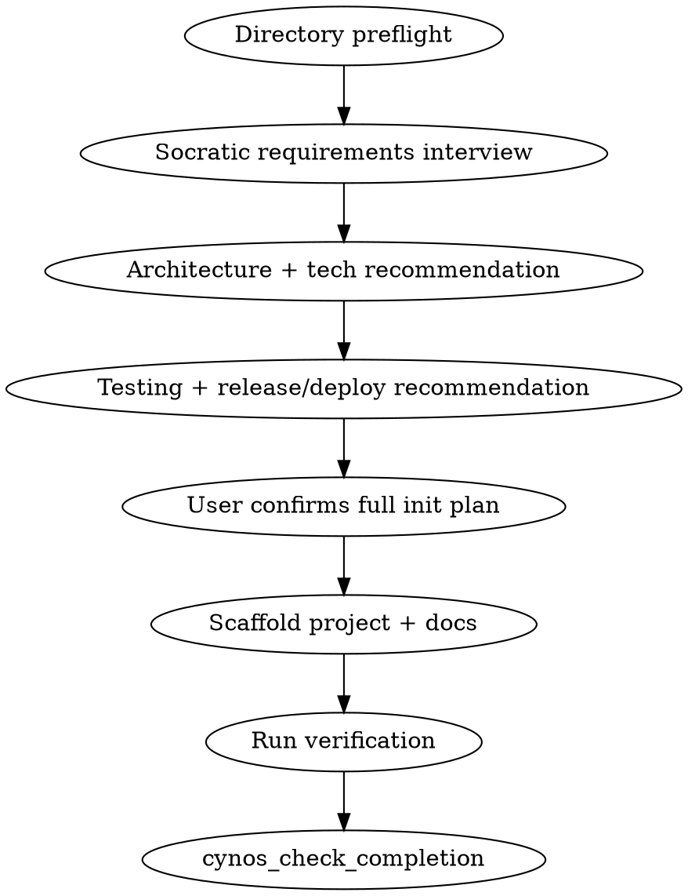

# Init Practice

Init is for a new project. Adding a module to an existing project is `develop` or `default`, not `init`.

Init is **requirements analysis + architecture design + technology selection + project initialization**. Do not jump straight to scaffolding.

## Required behavior

1. Once routing is clearly `init`, call `cynos_start_work(practice="init")` before audited actions. Minimal read-only target disambiguation before the work record is acceptable only to identify the target and avoid obvious destructive ambiguity; requirements interview, recommendations, confirmation, scaffold writes, verification, and finalization must happen inside the work record. Pre-start bash is not carried into the archive; if you ran `ls`, `find`, `git status`, or `test -e` before starting work, repeat a qualifying preflight command inside the active work before writing.
2. Follow the strict pre-write order below. Do not write, edit, create directories, run scaffold generators, install dependencies, run verification, initialize git, or commit until both directory preflight and final plan confirmation are captured.
3. For normal standalone code projects, recommend initializing a local git repository and committing the verified initial scaffold. If the target is already inside a git repository, use the existing repo. If the user explicitly says not to use git, confirm that this also means no initial commit and quote that decision in finalization.
4. For normal code projects, include a minimal appropriate testing or verification setup from day one. The no-test/no-build path is only for genuinely doc-only, meta, or config-only projects.

### Why the pre-write order is strict

Init creates the first durable structure of a project. The archive must prove two facts before the first scaffold mutation:

1. the target directory was inspected, so existing user files are not silently overwritten or mixed into a new project;
2. the user approved the full plan, because stack, testing, release, and git choices become long-lived project decisions.

Later evidence cannot repair a wrong order. A later `ls` cannot prove the directory was safe before the first write, and post-hoc approval is not real authorization. If scaffold writes happened before directory preflight or final confirmation, abandon/restart in a fresh or user-approved cleaned target instead of trying to patch the archive.

Required order:

1. `cynos_start_work(practice="init")`;
2. capture directory preflight, usually `ls -la .`;
3. interview, recommend, and present the full plan;
4. call `cynos_ask_user` for final plan confirmation;
5. wait for `cynos_resume_work` / `capturedUserAnswers`;
6. only then create directories, write/edit files, run generators, install dependencies, verify, initialize git, or commit.

## Flow



## Directory preflight

Before planning writes, ensure the archive will contain a target-directory observation before the first scaffold write/generator/mkdir mutation. The safest sequence is:

1. call `cynos_start_work(practice="init")`;
2. immediately run `ls -la .` or another qualifying directory content/status command;
3. only then interview, confirm, scaffold, run generators, or create directories/files.

Accepted preflight evidence:

- `ls -la .`, `find . -maxdepth 2 ...`, `git status`, `test -e <file>`, or reading an existing root file;
- failed `git status` in a non-git directory, and failed `test -e/-f/-d <known-file>` as a collision check;
- carried pre-start `read` / `cynos_search` / `cynos_fetch` context for an existing root file. Pre-start bash is not carried into the archive and does not count.

Examples:

- ✅ after `cynos_start_work`: run `ls -la .` before any `write`, `edit`, `mkdir`, `npm create`, or scaffold generator;
- ✅ read an existing `README.md` before deciding how to merge or preserve it;
- ❌ `pwd` only;
- ❌ claiming in text that the directory was checked before the work record;
- ❌ running `mkdir -p`, writing `package.json`, or launching a generator before content/status preflight.

Then identify whether the directory is empty, partially initialized, or already a project. If writing into a non-empty directory, include overwrite/additive behavior in the confirmation request.

## Socratic requirements interview

Use a guided interview, not a generic long form. Ask high-impact questions one at a time or in a concise grouped prompt when they are tightly related.

Prefer multiple choice with a recommendation:

```markdown
## Q: Primary delivery target

**Recommended**: Option A — it gives the smallest deployable MVP and keeps future migration easy.

| Option | Answer | Implication |
|---|---|---|
| A | Web app | Fastest iteration, browser deployment, easiest preview |
| B | CLI | Best for automation-first usage |
| C | Desktop | Needed only if local OS integration is core |
| Custom | Describe another target | I will adapt the plan |
```

Question priority:

1. problem and target users;
2. MVP scope and explicit non-goals;
3. data model, identity, permissions, privacy/security;
4. integrations/credentials/external APIs;
5. deployment target and operational constraints;
6. testing expectations and acceptance criteria.

Do not ask questions whose answers can be safely assumed or deferred. Missing non-blocking details become explicit assumptions/open questions in the plan.

Record evidence as `init.requirementsInterview`:

- `problemStatement`
- `targetUsers` / `primaryUseCases` when relevant
- `mvpScope`
- `nonGoals`
- `constraints`
- `assumptions`
- `successCriteria`
- `openQuestions`

## Architecture and technology recommendation

AI must recommend, not merely ask the user to choose from a blank slate.

Present 2–3 viable options:

- one recommended option;
- one or two credible alternatives;
- core idea / stack;
- pros, cons, risks;
- testing and deployment implications;
- why the recommendation fits the stated goal.

Use the user's constraints and the project type. Prefer boring, stable, AI-friendly technology:

- clear APIs and common examples;
- strong type feedback or fast runtime error feedback;
- active ecosystem and predictable releases;
- low ceremony for the user's stated scale;
- easy local verification and CI automation;
- minimal dependency count unless the tradeoff is explicit and user-authorized.

Avoid speculative architecture or unnecessary dependencies.

The user decides key architecture choices. Even if the user initially specified a stack, present the full initialization plan and call `cynos_ask_user` for confirmation before writing files.

## Testing and release/deploy selection

Testing and release/deploy are part of init, not afterthoughts.

Recommend a testing strategy and ask the user to confirm or adjust:

- current verification command(s) that should pass immediately after scaffold;
- unit/integration/e2e strategy appropriate to the stack;
- `docs/testing.md` matrix by change scope;
- `docs/testing.md` Diagnostic / log map for test output, browser console/network, backend/worker logs, CI logs, and read-only DB diagnostics when relevant;
- commands must be runnable from the project root (use `cd subdir && ...` or `--manifest-path` for nested projects);
- `currentCommands` must be copy-pasteable complete commands; do not write placeholders such as `above`, `same`, `manual`, or commands that swallow failures such as `|| true` / `set +e`.

Recommend a release/deploy flow and ask the user to confirm or adjust:

- `none`: no release/deploy yet;
- `local-only`: local usage only, no external publishing;
- `package-release`: package/app artifact release;
- `deploy`: service/site deployment;
- `unknown`: user deferred the decision.

Always write `docs/release.md`. If there is no external release yet, write the local/no-release contract and how to update it later. Include rollback strategy.

If you generate deploy-related files (for example `Dockerfile`, `docker-compose.yml`, `vercel.json`, `fly.toml`) while the current classification is `none` or `local-only`, explicitly mark them as planned/inactive in `operatingDecisions.release.generatedDeployArtifacts[]` and set `activeDeploy: false`. Distinguish current release flow from future deploy artifacts.

## Decision summary and final plan confirmation

The interview may take one or multiple rounds. Keep a concise `init.decisionRounds[]` only when it helps summarize meaningful requirement, architecture, testing, or release choices. Each item should have a `topic` and a short `summary` or `decision`. Do not manually cross-reference runtime answer indexes; `cynos_ask_user` / `cynos_resume_work` already records the real user answers in `capturedUserAnswers`.

Before writing any scaffold files, send a final confirmation prompt covering:

- requirements understanding;
- MVP scope and non-goals;
- recommended architecture/tech stack and alternatives;
- testing strategy;
- release/deploy strategy;
- git strategy (`git init` + initial commit for normal standalone code projects, existing repo usage, or explicit no-git/no-commit exception);
- files to be written;
- package installs / commands to run;
- overwrite risks, if any.

Wait for `cynos_resume_work`. Record `init.finalPlanConfirmation.confirmed=true` and `userConfirmationSummary`.

Anti-patterns:

- ❌ Do not scaffold first and ask the user to formally confirm the already-built project.
- ❌ Do not install dependencies, run tests, initialize git, or commit before captured final confirmation.

## Scaffolding

Generate a minimal runnable skeleton:

- community-standard structure for the chosen stack;
- config/dependency files;
- basic entry point;
- `README.md` — human-facing project purpose, setup, usage;
- `AGENTS.md` by default (or `AGENT.md` if user/project preference) — operational rules for future agents;
- root `PROJECT.md` — concise long-term project memory and decisions;
- `docs/testing.md` — required testing/verification contract, including verification matrix and diagnostic/log map;
- `docs/release.md` — required release/deploy/rollback contract, even if local-only/none;
- `docs/testing.md` surface-verification section and optional `tests/e2e/` when browser/surface-verification validation is relevant;
- root `brand-spec.md` when the project has a UI/design system.

After package installation / generator execution / manual scaffold writes, reread the actual manifest and key config files before finalizing docs. Examples: `package.json`, `pyproject.toml`, `Cargo.toml`, `go.mod`, `vite.config.ts`, `tsconfig.json`, generated lock/config files. Record only those generated source-of-truth manifest/config files in `init.postScaffoldAudit.auditedFiles[]`. Do not list `README.md`, `PROJECT.md`, `docs/testing.md`, `docs/release.md`, `node_modules/**`, vendored dependencies, or dependency-internal package files there; those operational docs are finalized after the audit read, and dependency internals are not project source-of-truth. If you inspected source files for sanity or checked dependency versions from install/package-manager output, summarize that in `docsConsistencySummary` unless you intentionally want the files to participate in the strict audit ordering gate.

### Projects with no runnable verification (meta-repos, doc-only, config-only)

Some init targets (e.g. an aggregation monorepo that only re-points existing repos, a docs-only repo, a config-only repo) genuinely have no test/build/lint suite to run. This is an exception, not the default for code projects. In that case:

- do **not** fabricate a `package.json` / `Makefile` / test runner the project does not need just to pass the verification checkpoint;
- in `docs/testing.md` record the verification strategy honestly: set the relevant `matrix` row's `status: none` / `not-applicable` (or `pathlessReason`) and explain why no automated suite exists yet;
- in `verification.summary` explicitly state that this project currently has no automated test/build/lint suite and reference the `docs/testing.md` rationale;
- still run one lightweight, substantive invariant check that reflects the project, such as `test -f PROJECT.md`, `test -f docs/testing.md`, `test -d <subproject>`, `node --check <file>`, or `python -m py_compile <file>`, and record that command in `docs/testing.md`.

Read `skills/cynos/references/project-memory.md` before drafting durable memory. Avoid over-engineering. No speculative DDD/hexagonal architecture unless justified by the actual project.

## Durable document intent

- `README.md`: for human onboarding and basic usage.
- `AGENTS.md` / `AGENT.md`: repo-local rules for future agents.
- `PROJECT.md`: short high-signal project memory: goal, architecture, key decisions, constraints, risks, links to testing/release docs.
- `docs/testing.md`: verification matrix, current/planned commands, and Diagnostic / log map for future debug/usability work.
- `docs/release.md`: release/deploy classification, commands/steps, rollback, versioning if applicable.

## Completion evidence

The exact `completionEvidence` schema returned by `cynos_start_work` / failed `cynos_check_completion` is authoritative. Required intent:

- `criteriaCoverage` covers every acceptance criterion;
- `init.requirementsInterview` records problem, MVP, constraints/assumptions, and success criteria;
- `init.recommendation` records recommended architecture/tech option plus alternatives and rationale;
- optional `init.decisionRounds[]` summarizes meaningful choices without runtime answer indexes;
- user confirmation must be captured through `cynos_ask_user` / `cynos_resume_work` before scaffolding; do not scaffold first and ask the user to formally confirm an already-built project;
- `init.finalPlanConfirmation.confirmed=true` records final authorization;
- `init.postScaffoldAudit` records generated manifest/config/source-of-truth files reread after generation/installation and confirms docs were calibrated to actual facts; keep operational docs out of `auditedFiles[]` because README / PROJECT.md / docs/testing.md / docs/release.md are finalized after that audit;
- `scaffold.files` summarizes generated files; real write/edit results are auto-matched from `capturedToolResults`;
- `README.md`, `AGENTS.md`/`AGENT.md`, `PROJECT.md`, `docs/testing.md`, and `docs/release.md` are mandatory real writes;
- for normal code projects, create or select a minimal appropriate test/verification setup and run one real clean successful command (e.g. `npm test` / `npm run build` / `go test` / `go vet` / `cargo check` / `pytest` / `make verify` / a project-defined `./scripts/verify.sh`); `verification.summary` should describe which command passed and what it covered — do NOT chase runtime tool IDs, the checkpoint infers evidence from captured bash results;
- **never fabricate a build/test file the project would not otherwise need** (e.g. adding a root `package.json` to a JS-less monorepo) just to satisfy the verification checkpoint; if the project genuinely has no automated suite, say so explicitly in `verification.summary`, make sure `docs/testing.md` records the strategy, and run a lightweight substantive invariant check;
- `operatingDecisions.testing.matrix[]` defines future verification by change scope;
- `operatingDecisions.release.classification` and `rollbackStrategy` define future release/deploy/rollback behavior; generated deploy artifacts must be marked inactive/planned when classification is `none` or `local-only`;
- `finalization` defines the new project's future git/release/rollback contract. For normal standalone code projects, include `git init` and an initial commit in the confirmed plan, then follow the Cynos local commit policy after verification. If the target directory is already a git repository, use that repo. If the user explicitly opts out of git, record `commit.status='not-committed'` and quote the explicit no-git/no-commit authorization in `commit.reason`. If `git commit` fails, record `commit.status='failed'` with the real failure reason.

Do not guess or chase runtime internal IDs; leave evidence inference to captured tool results.
