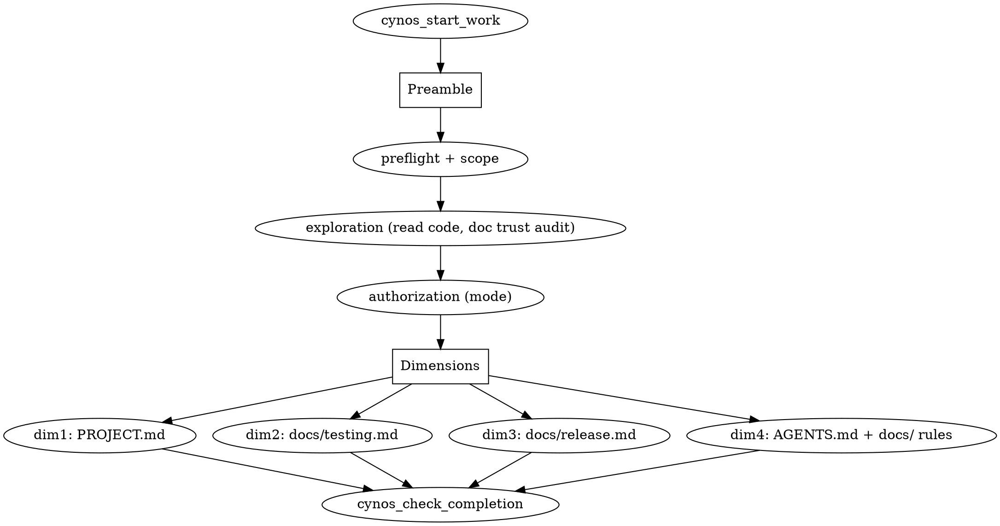

# Onboard Practice

Goal: build or refresh the project's **maintenance baseline** — accurate, high-signal understanding plus the conventions future agents need to work correctly in this project. Onboard is the agent understanding the project and固化 the result; it is not primarily a human-facing tutorial.

Follow the configured onboard mode from `~/.pi/agent/cynos-engineer.json` (set via `/cynos-config`):

- Read config first when possible. Missing/invalid `onboardMode` defaults to `human-assisted`.
- Start the auditable work with `cynos_start_work(practice="onboard")` before asking scope questions.
- `human-assisted` (default): ask only for facts code cannot determine, but always use real `cynos_ask_user`/`cynos_resume_work` for scope confirmation before deep reading and for final baseline approval before writing.
- `auto`: do not wait for user confirmation; make conservative decisions from code/CI/docs evidence and record `automationDecision` plus unresolved questions.
- Do **not** write `~/.pi/agent/cynos-engineer.json` during onboard. Mode is a user preference owned by the config layer; users change it via `/cynos-config`, not via the practice.

## How onboard work is organized: shared preamble + four dimensions

Onboard builds a maintenance baseline of **four independent dimensions sharing one preamble**:

- **preamble** — preflight (scope) + exploration (read code) + authorization
- **dimension 1 — project understanding**: `PROJECT.md`
- **dimension 2 — verification contract**: `docs/testing.md`
- **dimension 3 — release contract**: `docs/release.md` (conditional)
- **dimension 4 — engineering contract**: `AGENTS.md` + `docs/` rule files

Exploration is **shared and done once** — read the code once, feed every dimension. The four dimensions are **independent**: each has its own evidence field, its own checkpoint, and can be completed, verified, or later refreshed on its own. You do not have to finish them in a fixed order; do what the project shape calls for.



## Shared preamble

### Start the work before deep reading

Call `cynos_start_work(practice="onboard")` before the focused context scan (scope questions via `cynos_ask_user` and any audited actions require an active work). Pre-start context reads are carried over into the work record, so you do **not** need to re-read files you already read for routing — but every file you list in `coreFilesRead` / `coreLogicFiles` / `signalsChecked` / `docTrustAudit` must have a real `read` tool result. **Full-read** core logic files from the start — do not use partial `read` with `limit`/`offset`, the gate rejects partial reads.

### Preflight + scope gate

Before deep code exploration:

- git status / repo shape
- whether uncommitted changes are intended current state
- whether this is the latest intended code snapshot
- if `human-assisted`: after preflight and before deep code exploration, call `cynos_ask_user` to pause and confirm scope. The answer determines what you explore and what baseline you write — it has audit value and changes the next safe action.
- if `auto`: document your scope assumption and proceed conservatively.

### Code-first exploration strategy

Do not equate entrypoints, routers, APIs, or registries with core business logic. They are navigation files: useful because they show how requests/commands/events enter the system and where to look next. The core logic is where project-specific rules, state, data flow, domain decisions, protocols, or irreversible side effects live.

Recommended strategy:

1. Build a project profile from manifests/config: package manager/runtime/framework, monorepo shape, app/library/CLI/backend/frontend/extension, and test/release tooling.
2. Read navigation files only to find the path inward: `main`, `bin`, package `exports`, server/app bootstrap, routes, command registries, plugin/extension registries.
3. Follow edges from navigation into behavior: entrypoint → handler/usecase → domain/state/rule engine → persistence/config/external API; test → subject under test; doc claim → code/config that confirms or rejects it.
4. Choose core logic files. For normal projects, default to 4+ fully-read core logic files. Tiny or intentionally narrow-scope onboard may read fewer, but then you must record `smallProjectReason` or `coverageGaps[]` rather than silently lowering depth.
5. Trace behavior, not filenames. Default to 2+ cross-file flows and 2+ followed edges. If you trace fewer, `coverageGaps[]` must state which flows/layers remain unverified, why, and what future agents should read before relying on that area.
6. Cover behaviorally significant layers, without hard-coding one project type. If the system has multiple layers (UI state, IPC/adapters, backend/domain services, persistence, external integrations, workers/CLI, etc.), select core logic from each layer that owns important behavior or risk.
7. Record the chain in `exploration.readStrategy`:

```json
{
  "projectType": "extension",
  "navigationFiles": ["index.ts", "extensions/practices/registry.ts"],
  "coreLogicFiles": ["extensions/core/completion-check.ts", "extensions/practices/checkpoints/onboard.ts", "extensions/core/state.ts", "extensions/hooks/index.ts"],
  "layerCoverage": [
    { "layer": "runtime state", "files": ["extensions/core/state.ts"], "reason": "work lifecycle and user-answer capture" },
    { "layer": "completion gate", "files": ["extensions/core/completion-check.ts", "extensions/practices/checkpoints/onboard.ts"], "reason": "deterministic completion rules" },
    { "layer": "prompt/tool integration", "files": ["extensions/hooks/index.ts"], "reason": "agent behavior and protocol gate" }
  ],
  "followedEdges": [
    { "from": "index.ts", "to": "extensions/core/tools.ts", "reason": "extension registers Cynos tools" },
    { "from": "extensions/core/tools.ts", "to": "extensions/core/completion-check.ts", "reason": "completion gate invokes practice checkpoints" }
  ]
}
```

`exploration.coreFilesRead` must include the core logic files and any additional navigation/test/config files that support the traced flows. `layerCoverage` should explain why the selected core files cover the project's important behavioral layers. `flowsTraced` should describe cross-file flows, not a list of filenames.

`layerCoverage[].files` may include navigation files (e.g. `app/main.py`, route modules) — list them only if they belong to the layer you are describing, and keep them in `navigationFiles`, **not** `coreLogicFiles`. Do not force a navigation file into `coreLogicFiles` just to make lists match; `coreLogicFiles` is for files that own project-specific rules/state/decisions, not entry points.

If depth is below the default target and this is not a genuinely tiny project, add `coverageGaps[]` either under `exploration` or `exploration.readStrategy`:

```json
[
  {
    "area": "persistence layer",
    "reason": "current user scope was limited to frontend routing and state; database code was not read in this onboard pass",
    "impact": "PROJECT.md must not claim storage invariants; future backend changes should first read src/db/** and migrations"
  }
]
```

Do not use `coverageGaps` as an excuse for shallow reading. It is a confidence boundary: it makes unverified layers visible so future agents do not treat partial understanding as whole-project truth.

### Document trust audit

Treat docs as hypotheses until verified against code or user-confirmed. Audit the documents most likely to shape future agent behavior. Priority order:

1. `PROJECT.md`
2. `AGENT.md` / `AGENTS.md`
3. `README.md`
4. `docs/testing.md`
5. `docs/release.md`
6. `docs/architecture.md`
7. `docs/api.md`
8. `docs/design.md`

If any of these exist, read at least the relevant high-value docs and record a trust conclusion. Do not merely say "looks good". Each entry needs a basis or code/config files verified against. If you only read part of a document (for example `read` with `limit`/`offset`), the audit must state `auditedScope` and the conclusion must be scoped to the part read — never endorse the whole document from a partial read. Record `docTrustAudit` entries as `{ file, conclusion, basis }` or `{ file, conclusion, verifiedAgainst: [...] }`; if there are no relevant docs, provide `docTrustAuditNotApplicableReason`.

```json
{ "file": "README.md", "conclusion": "partially accurate: install command matches package.json but release section is stale", "verifiedAgainst": ["package.json", ".github/workflows/release.yml"] }
```

### Authorization (mode)

- `human-assisted`: before writing the baseline, call `cynos_ask_user` to confirm the full baseline draft (PROJECT.md, docs/testing.md, optional docs/release.md, AGENTS.md, git/ui decisions). This is a correctness risk and has audit value. You need at least two real captured answers: scope confirmation (before deep reading) and final baseline approval (before writing).
- `auto`: write only high-confidence facts and record `automationDecision.rationale` and `unresolvedQuestions`.

## Dimension 1: project understanding (`PROJECT.md`)

Read `skills/cynos/references/project-memory.md` before drafting.

`PROJECT.md` is **for the AI to understand the business** — especially design decisions that do NOT follow convention and their rationale, so later agents do not "fix" intentional designs as bugs. The AI lacks the business intuition a human has; PROJECT.md fills that gap.

Include facts that require synthesis across files:

- architecture boundaries
- domain concepts and state machines
- cross-module workflows
- integration contracts
- **non-obvious design decisions and why they are that way** (the highest-value content — things that look wrong but are intentional)
- project-specific risks and conventions
- concise links to testing/release/engineering docs
- open questions future agents must know

Keep PROJECT.md concise (ideally 80–160 lines; audit if >220), but do not optimize away critical verified risks. Preserve high-value maintenance hazards such as version mismatches, cross-layer type mismatches, security-sensitive assumptions, disconnected UI/backend functionality, stale docs that future agents may trust, and untracked files that affect behavior. Record them in `projectMemory.criticalRisks[]` (each with `summary` + `evidence` or `verifiedAgainst[]`), or explain `noCriticalRisksReason`.

Do not include: directory trees, endpoint inventories, values obvious from one config file, raw exploration notes, long testing/release manuals, stale claims not verified by code or user.

`brand-spec.md` is **not produced here.** UI/design system context is owned by the `ui-design` practice. In onboard, only note whether the project has a UI and where its design tokens live.

## Dimension 2: verification contract (`docs/testing.md`)

`docs/testing.md` is a **required hard output** — the testing contract that later practices (develop/debug) read before running verification. Always write it, even if the project has no tests yet (then document the gap and the plan).

### Discover the testing contract from code, not by asking

Before writing `docs/testing.md`, discover the project's real verification shape from code. Record every evidence file in `testingContract.signalsChecked`.

**`signalsChecked` entries MUST be literal file paths** (e.g. `"package.json"`, `"tsconfig.json"`, `".github/workflows/ci.yml"`), each backed by a real `read` tool call in `capturedToolResults`. Do not write descriptions (`"package.json scripts.test"`) or `bash`/`ls` directory listings (`"src/"`) — the gate matches each entry against a `read` tool result by path. The same rule applies to `releaseContract.signalsChecked`.

Read:

- `package.json` scripts (test/test:unit/test:e2e), `Cargo.toml`, `pyproject.toml`, `go.mod` — what test commands actually exist?
- CI config (`.github/workflows/`, `.gitlab-ci.yml`, etc.) — what does the project actually run in CI? This is the ground truth for "what counts as verification."
- test directories (`tests/`, `__tests__/`, `e2e/`, `spec/`) and framework config (`playwright.config`, `vitest.config`, `jest.config`).
- monorepo signals (`workspaces` in package.json, `pnpm-workspace.yaml`, Lerna, Turborepo) — does a change in one package require running tests in dependent packages?
- IPC/bridge boundaries (Tauri, Electron, FFI) — cross-stack changes need integration verification, not just unit tests.

Only after investigating, ask the user about facts code cannot determine: intended coverage targets, known-flaky tests, manual verification that's expected but not scripted.

### Verification matrix

`docs/testing.md` should capture a **verification matrix**, not a one-line summary:

```markdown
## Verification matrix

| change scope | paths | current runnable verification | planned verification | notes | status |
|---|---|---|---|---|---|
| Rust services | `src-tauri/src/**/*.rs` | `cargo test` if tests exist | add unit + integration tests | service logic should be fixture-testable | planned |
| React frontend | `src/**` | `npm run build` | add vitest + browser surface verification | do not list `npm test` as current unless script exists | partial |
| Tauri IPC bridge | `src-tauri/src/commands/**` + `src/stores/**` | manual smoke | Tauri WebDriver | cross-stack behavior | planned |
| config/docs | `*.md`, config files | review only | — | none | established |
```

**Why `paths` matters:** paths turn the matrix from vague advice into an operational guide. Later agents look at their changed files and immediately know which row applies. Without paths, `docs/testing.md` becomes a prose hint. Multi-stack/multi-package projects almost always need `paths`; single-stack projects with one obvious test command may omit `paths` only with a `pathlessReason`.

Separate **current runnable verification** from **recommended future tests**. Do not put an unavailable command such as `npm test` in the current column unless it actually exists. `testingContract.matrix[]` rows need `changeScope`, `paths` (or `pathlessReason`), and at least one of `currentCommands`, `plannedCommands`, or `status`.

`currentCommands` must be directly runnable from the project root. If verification lives in a subdirectory, include the directory change or manifest path (e.g. `cd src-tauri && cargo build`). Do not put placeholders such as `manual: ...`, `review only`, `above`, `same`, `n/a`, or commands that swallow failures (`|| true`, `set +e`) in `currentCommands`; use `status`, notes, or `plannedCommands` for manual/non-runnable verification.

### Diagnostic / log map

`docs/testing.md` must also include a **Diagnostic / log map** when the project has any discoverable runtime or CI diagnostic source. This map tells later debug/usability work where to look after a failure:

```markdown
## Diagnostic / log map

| area | when to inspect | source/location | command or method | notes |
|---|---|---|---|---|
| test runner | unit/integration test failed | terminal output / test report | `npm test -- ...` | read full stack, not only tail |
| browser console | UI/user-flow bug | Playwright/browser console | `npx --yes @playwright/cli ... console` | console errors are browser evidence |
| network | request/user-flow failure | browser network / Playwright requests | `... requests` | inspect failed status/body |
| backend logs | API/server error | stdout / logs / docker / journalctl | project-specific | redact secrets |
| database | state/data bug | local/dev/test DB | read-only queries only | mutation forbidden by default |
| CI logs | CI-only failure | GitHub Actions/GitLab/etc. | web UI / CLI | use when local repro differs |
```

Do not invent log paths. If no stable diagnostic source exists, document the gap/status rather than making up commands. `ci-only` release classification belongs primarily here in testing, not in a release runbook.

## Dimension 3: release contract (`docs/release.md`, conditional)

Classify release state from evidence, not vibes. Record inspected files in `releaseContract.signalsChecked` and classify as:

- `none`: no release/deploy/package signal found.
- `ci-only`: CI exists but only runs checks/tests/builds; document under testing, no `docs/release.md` required.
- `package-release`: package publishing/version/tag/changelog release flow exists; write `docs/release.md`.
- `deploy`: production/staging deploy flow exists; write `docs/release.md`.
- `unknown`: signals conflict or human decision is needed. In `human-assisted`, ask; in `auto`, record unresolved question.

Look for: package scripts (`release`, `publish`, `deploy`), CI workflows, changelog/version files, Docker/image publishing, hosting configs, README release sections, tags/version conventions.

For `package-release` / `deploy`, record version facts by source. Do not write the desired state as if it were current fact. If versions differ, preserve the mismatch in both evidence and docs:

```json
"releaseContract": {
  "classification": "package-release",
  "versionSources": [
    { "source": "package.json", "version": "0.2.6" },
    { "source": "src-tauri/tauri.conf.json", "version": "0.2.6" },
    { "source": "src-tauri/Cargo.toml", "version": "0.2.4" }
  ],
  "versionConsistency": "mismatch",
  "versionMismatchSummary": "Cargo.toml lags package.json/tauri.conf.json"
}
```

If there is genuinely no release flow, set `classification: "none"` and `notApplicableReason` — do not fabricate one.

## Dimension 4: engineering contract (`AGENTS.md` + `docs/` rule files)

The engineering contract tells future agents **how engineering work is done in THIS project** — the conventions a newcomer (human or AI) would otherwise violate by default. It is the highest-leverage dimension: **pi auto-loads `AGENTS.md` into every later agent's context**, so what you establish here is automatically in effect for develop/debug/refactor.

### `AGENTS.md` — the short entry (pi auto-loads it)

Establish `AGENTS.md` at the project root. Keep it **SHORT** — it is an entry point and routing table, not a dump of every convention. Three parts:

1. **Tech-stack summary** — a compact table of the stack per area (frontend/backend/AI/tooling/format/test). This orients later agents instantly.
2. **On-demand routing table** — a table mapping task triggers to rule files in `docs/`. Later agents match their task's keywords and load only the relevant rule file, instead of reading every convention up front.

   | triggers | rule file | core content |
   |---|---|---|
   | 写代码, 修Bug, 重构, debug | docs/conventions.md + docs/testing.md | API/DB/security/error-code/config/log conventions; verification |
   | 提交, commit, git, push | docs/conventions.md | git commit rules, pre-commit checks |
   | 部署, Docker, docker-compose | docs/deployment.md + docs/release.md | deploy/Docker conventions; release flow |
   | 架构, 模块, 分层 | docs/architecture.md | architecture principles, directory layout |

3. **Behavior basics** — a few non-negotiable global rules (e.g. "read related code before changing", "verify before finishing", "no hardcoded secrets", "minimal change").

### Dispersed rule files under `docs/`

Put detailed conventions in `docs/` rule files (alongside `docs/testing.md` and `docs/release.md` — not in a `docs/rules/` subdirectory, so all conventions live in one flat place). Group related small conventions into one file (e.g. `docs/conventions.md` holding API/DB/security/error-code/config/log sections separated by `---`); keep large ones in their own file (e.g. `docs/architecture.md`, `docs/deployment.md`). Decide grouping by project shape, not a fixed template.

The routing table in `AGENTS.md` references these files. **Every referenced file must really be written — no dangling routes.** `docs/testing.md` (dimension 2) and `docs/release.md` (dimension 3) should appear in the routing table too, as the "verification" and "release/deploy" rule files.

For small projects, you may put a few conventions directly in `AGENTS.md` and skip dispersed rule files (the routing table is optional). For larger projects, disperse — that is what the routing table is for.

### Rewriting an existing `AGENTS.md`

If an `AGENTS.md` already exists, **READ it first** — the agent has at least as much context as a human, and the existing file encodes prior decisions. Then **rewrite it WHOLESALE** from your fresh understanding — do not patch. Patching leaves stale content that conflicts with the new version; rewriting produces one coherent file that incorporates the intent of the old content. Record `engineeringContract.agentsMd.reviewedExisting = true`.

### git and ui conventions

Record git workflow conventions (branch/commit/PR norms) and UI/design conventions (component library, design system, theme source) in `engineeringContract.git` and `engineeringContract.ui` — or point them at a rule file in the routing table. These may be brief; the point is future agents know they exist.

## Finishing up

If onboard wrote durable assets in a git repository, follow the Cynos local commit policy after the final approval/auto decision and before completion unless the user opted out. If `git commit` fails, record the real failure reason; do not bypass hooks or retry blindly. Finish with `cynos_check_completion`.

## Completion evidence

The exact `completionEvidence` schema returned by `cynos_start_work` / failed `cynos_check_completion` is authoritative. Intent, organized by the four dimensions + shared preamble:

**Shared preamble**

- `criteriaCoverage` covers every acceptance criterion
- `preflight` records git/scope state and final mode
- `exploration.coreFilesRead` lists files actually read with tools
- `exploration.readStrategy` records `projectType`, `navigationFiles`, `coreLogicFiles`, `layerCoverage`, `followedEdges`; default depth is 4+ core logic files, 2+ flows, 2+ edges; below that, provide `smallProjectReason` or `coverageGaps[]`; core logic files must be fully read with `read`
- `exploration.flowsTraced` records synthesized core flows
- `exploration.docTrustAudit` contains `{ file, conclusion, basis }` or `{ file, conclusion, verifiedAgainst }` entries, or `docTrustAuditNotApplicableReason`; partial reads require `auditedScope`/`scope`
- human-assisted mode must have real captured user answers for scope and final baseline approval; auto mode records `automationDecision.rationale` and `unresolvedQuestions`

**Dimension 1 — project understanding**

- `projectMemory.path` is project-root `PROJECT.md`, really written
- `projectMemory.criticalRisks[]` records verified critical risks (each with `summary` + `evidence`/`verifiedAgainst[]`), or `noCriticalRisksReason` explains none were found

**Dimension 2 — verification contract**

- `testingContract.signalsChecked` lists real-read evidence files
- `testingContract.matrix[]` mirrors the verification matrix in `docs/testing.md`
- `docs/testing.md` is a mandatory real write

**Dimension 3 — release contract**

- `releaseContract.classification` must be `none`, `ci-only`, `package-release`, `deploy`, or `unknown`
- `releaseContract.signalsChecked` lists real-read evidence files
- `package-release`/`deploy` must record `versionSources[]` and `versionConsistency`; `docs/release.md` must really be written
- `none`/`ci-only` may use `notApplicableReason` instead of fabricating a release flow

**Dimension 4 — engineering contract**

- `engineeringContract.agentsMd` declares the AGENTS.md establishment (with `reviewedExisting` if one existed)
- `AGENTS.md` at the project root is a mandatory real write (rewritten wholesale, not patched)
- `engineeringContract.routingEntries[]` (optional) maps triggers → rule files; every referenced rule file must really be written
- `engineeringContract.git` and `engineeringContract.ui` record (or link to) git and UI conventions

Optional `toolCallId` fields are only for explicit references; leave them out rather than guessing.
