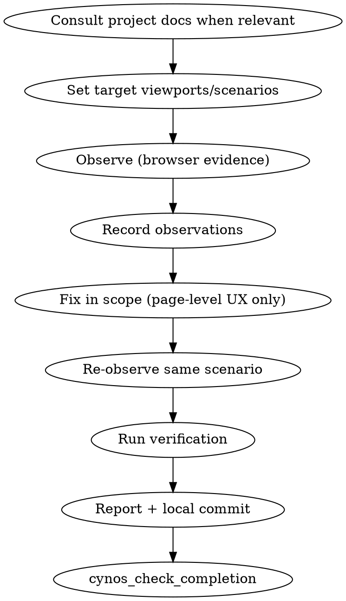

# Usability Practice

Usability is the **browser-first page-level UX optimization expert** practice. Use it when the user asks to check or fix "it works but it's not good to use" front-end problems on an existing page/control/interaction: responsive layout, overflow/clipping, touch target size, modal/popover bounds, keyboard/focus health, loading/empty/error states, unclear help text, and page-level interaction friction. The work is driven by browser observation, targeted page-level fixes, and re-observation of the same scenario. A usability motivation does not change routing: adding a new visible control, user-triggered action, command, capability, flow, or rule is `develop`.

Start with `cynos_start_work(practice="usability")`. Finish with `cynos_check_completion({ completionEvidence })`; do not claim usability work is complete until the gate passes.

## Boundaries

- Usability ≠ `debug`: debug finds root causes of bugs (things that don't work: click does nothing, data is wrong, errors occur); usability optimizes things that work but are awkward or hard to use.
- Usability ≠ `develop`: develop implements features and business/product behavior changes. Usability may include small page-level interaction improvements to **existing** controls/interactions (focus trap, scroll lock, Escape close for an existing modal, hit area, help text), but **does not add new visible controls, user-triggered actions, commands, capabilities, flows, rules, business logic, data flow, APIs, auth/permissions, or core product behavior**. If the request says to add/create/support/enable a new button, action, command, flow, or rule, route to `develop` even when the motivation is usability.
- Usability ≠ `refactor`: refactor changes structure while preserving behavior; usability changes page-level experience.
- Usability ≠ `ui-design`: ui-design is visual design / brand / design system; usability is practical UX friction on an existing page.
- Usability is **strongly browser-dependent** (screenshot + DOM snapshot + console + network). Do not use static build/typecheck as browser evidence. Non-web projects with a web part (Tauri webview, admin panel) may use usability on their web part.

Routing examples:

- ✅ `usability`: make an existing email input wider; improve focus order for existing fields; add scroll lock/focus trap/Escape close to an existing modal; make an existing button easier to tap; clarify helper text for an existing input.
- ❌ `develop`: add a Clear email button; add a Save draft action; add a new keyboard shortcut that triggers a command; add a new modal flow; support a new validation/business rule.

## Flow

## Required behavior

1. **Consult project memory when it matters.** `PROJECT.md` and `docs/testing.md` may define frontend architecture, design-system boundaries, browser/surface-verification commands, the verification matrix, and frontend verification expectations. Read them when the target page/flow, verification choice, or project constraints are not already obvious. This is a skill expectation, not a completion hard gate; do not fabricate doc reads for tiny unambiguous local checks. Read `docs/release.md` only if the usability issue directly involves release/deploy artifacts.
2. **Set target scenarios.** Record the target viewport list (e.g. mobile 360px, tablet 768px, desktop 1280px), interaction areas, and user flows you will observe. These become `usability.targets[]`.
3. **Observe with browser evidence.** Use the `browser-automation` skill. For each target scenario, capture snapshot/screenshot/console/requests. Store screenshots into `.cynos/browser-evidence/` (not the project root). Each observation must have its own `before` browser evidence.
4. **Record structured observations.** For each usability issue found, record: `id` (e.g. `obs-1`), `severity` (`blocking` / `important` / `minor`), `summary`, `area` (e.g. `responsive / mobile menu`), `before` (browser evidence: screenshot/snapshot path, console errors, viewport), and `status` (`fixed` / `deferred` / `wontfix`). Do not inspect session logs just to invent tool ids; the checkpoint can infer browser evidence from captured results.
5. **Triage by severity.** `blocking` and `important` observations must be fixed unless you have an explicit reason to defer (then record the reason). `minor` observations may be deferred — list them in `report.deferredItems[]`. Do not let a `blocking` issue be deferred silently.
6. **Fix in scope — page-level UX only.** Fix practical page experience issues on existing pages/controls/interactions: CSS/layout/markup, ARIA/focus order, z-index/spacing, touch targets, helper text, focus trap, scroll lock, Escape close for an existing modal, and similar local interaction details. Page-level interaction touches are adjustments to existing behavior, not new user actions/capabilities. Do not add new visible controls, commands, flows, validation/business rules, business logic, data flow, APIs, auth/permissions, persistence, or core product behavior. A `status='fixed'` observation needs real product file writes in `fix.filesChanged[]`; do not use `noFileChangeReason` to claim a fixed usability issue. If you touch page-level interaction behavior, record it in `scope.pageInteractionChanges[]` and `report.pageInteractionChanges[]`. If you discover a real functional change is needed, switch/ask for `debug` or `develop`; if you still declare `scope.functionalChangesIntroduced[]`, also expose it in `report.functionalChangesIntroduced[]` and expect a soft warning in checkpoint details. Record `scope.behaviorPreserved=true` when business/product behavior is preserved, with a summary of why.
7. **Re-observe the same scenario.** After all page-level fix writes, re-observe the **same page/user scenario** and record `after` browser evidence. The checkpoint does not judge screenshot content, target ids, or viewport equality; it verifies the mechanical chain: browser observation before the first fix write, real fix writes, and browser re-observation after the last fix write.
8. **Browser-blocked → degrade only when globally blocked from the start.** If Playwright chromium cannot launch before you can observe (e.g. missing `libasound.so.2`), record `usability.browserBlocked` with `reason`, `attemptedApproaches[]` (at least 2 things you tried), and `degradedEvidence` (what single non-browser evidence you fell back to, such as static DOM/code inspection plus a screenshot-unavailable note). The checkpoint also requires at least two real failed Playwright CLI browser attempts captured before the first fix write. After recording this, **continue immediately** — do not keep installing system libraries or hacking the environment. `browserBlocked` is not an after-the-fact replacement for re-observe: if any successful Playwright CLI browser evidence exists in the work, the global blocked fallback no longer applies. Do not write test assets when the browser is blocked — you cannot run them, and the test-assets checkpoint has no blocked fallback.
9. **Observe-only is allowed.** If the user only wants an observation report, record all observations with `status='deferred'` and skip fixes/re-observe. `report.fixesSummary` should state "observe-only, no fixes applied". The fixes checkpoint is satisfied when there are no `status='fixed'` observations.
10. **Run real verification.** Follow `docs/testing.md` to choose the verification command. A real successful build/test/verify command is required.
11. **Output a structured report.** Provide `report` with `summary`, `observationsSummary`, `fixesSummary`, `deferredItems` (if any), `behaviorPreserved`, `screenshots[]` (paths under `.cynos/browser-evidence/`), and `evidence[]`. If `scope.pageInteractionChanges[]` or `scope.functionalChangesIntroduced[]` is non-empty, mirror it in `report.pageInteractionChanges[]` or `report.functionalChangesIntroduced[]` so the final report exposes it structurally. The report should be directly usable as your final reply to the user.
12. **Local finalization only.** After successful verification, follow the Cynos local commit policy: commit this usability change locally unless the user explicitly opted out. Never push/tag/publish/deploy in usability. If `git commit` fails, record `commit.status='failed'` with the real reason; do not bypass hooks or retry blindly. If the user asks to publish/release, finish this work and wait for explicit `release` work.

## Subagents (recommended, not required)

- `looker` / `explorer`: for complex pages, let it scan the page first to surface issues. Usability's core is observation — a second pass can find what you missed.
- `reviewer`: after fixes, ask it to verify whether any functional behavior was introduced and whether relevant viewports were missed.

These are recommendations. Simple usability work does not need subagents.

## Completion evidence

The exact `completionEvidence` schema returned by `cynos_start_work` / failed `cynos_check_completion` is authoritative. Required intent:

- `criteriaCoverage` covers every acceptance criterion.
- `usability.targets` records the target viewport/scenario list.
- `usability.observations` records each usability issue with `id`, `severity`, `summary`, `area`, `before` browser evidence, `fix.filesChanged[]`/`after` when `status='fixed'`, and `status`.
- `usability.scope.behaviorPreserved` (boolean) + `behaviorPreservedSummary`; `pageInteractionChanges[]` for page-level interaction touches to existing behavior; `functionalChangesIntroduced[]` if any out-of-scope behavior was introduced.
- `usability.browserBlocked` (when browser cannot launch from the start): `reason`, `attemptedApproaches[]` (≥2), `degradedEvidence`; checkpoint also requires real failed browser attempts before fix writes and no successful browser evidence.
- `report` with `summary`, `observationsSummary`, `fixesSummary`, `behaviorPreserved`, `evidence[]`, structured page/functional change arrays when declared, and `screenshots[]` (paths under `.cynos/browser-evidence/` when such writes exist).
- `verification.summary` describes the real successful verification command.
- `finalization` records verification, git status, and local commit status.

Optional `toolCallId` fields are only for explicit references; leave them out rather than guessing. The completion check infers most browser evidence from captured tool results.
